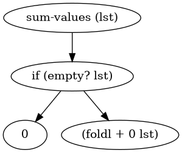

# Racket-to-Diagram


Have you ever wanted to make diagrams *after* you code? Now you can with this handy Racket system.

`rkt2diagram` is a library wrapper that lets you convert your plain Racket code into a diagram. How?

1. Create a new macro called `define/diagram`
2. The macro accepts plain code. Example:
```
(define/diagram (sum-values lst)
  (if (empty? lst)
      0
      (foldl + 0 lst)))
```
3. The code is evaluated as usual into a regular function, but the code is absorbed into an accumulator parameter list.
4. Once you're done defining functions/values, you execute with a function at the end.
5. Enjoy your new diagram in Graphviz DOT format




## How it works

The idea is to capture at the macro expansion level the code as an ordinary data list. The code data list is stored, then spat out as an ordinary `define` macro, which then gets evaluated as normal.

The code data list is then navigated as if it were a generic graph-like data structure. `if` has two edges, `cond` has many, and all the sections are linked and converted into a Graphviz language file called the DOT file.

With Graphviz you can then render a graphic representation of your code. Using the right command you can convert all code you graphed, as Graphviz may not allow for more than one graph per file.


## Requirements

This wholely depends on having Graphviz installed on your computer.
