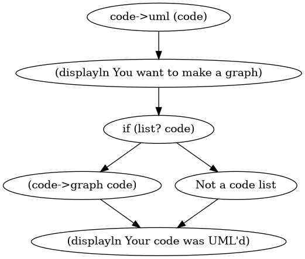

# Racket to UML Diagrams



Have you ever wanted to make UML diagrams *after* you code? Now you can with this handy Racket system.

rkt2uml is a library wrapper that lets you convert your plain Racket code into a diagram. How?

1. Create a new macro called `define/uml`
2. The macro accepts plain code. Example:
```
(define/uml (sum-values lst)
  (if (empty? lst)
      0
      (foldl + 0 lst)))
```
3. The code is evaluated as usual into a regular function, but the code is absorbed into an accumulator parameter list.
4. Once you're done defining functions/values, you execute with a function at the end.
